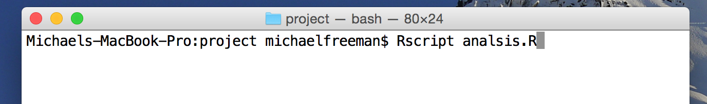
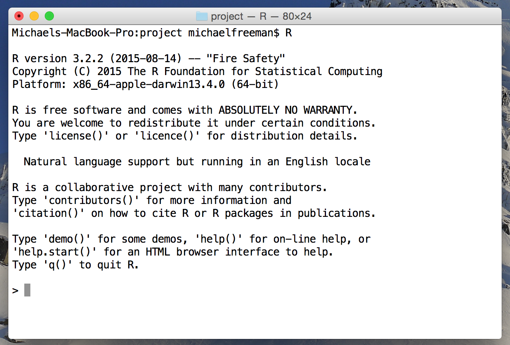
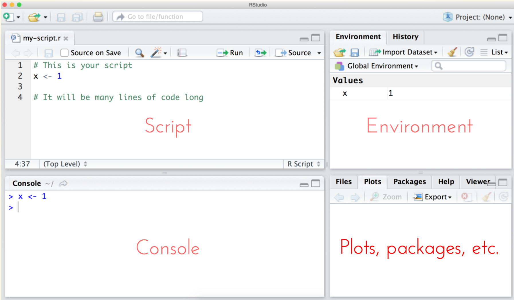

# Module 5: Introduction to R

## Overview
R is an extraordinarily powerful open-source software program built for working with data. It is one of the most popular tools for advanced data techniques, including statistical analysis, machine learning, and data visualization. R will be the primary programming language for this course, and we will develop a strong understanding of how to leverage the power of R.

<!-- START doctoc generated TOC please keep comment here to allow auto update -->
<!-- DON'T EDIT THIS SECTION, INSTEAD RE-RUN doctoc TO UPDATE -->
**Contents**

- [Resources](#resources)
- [Writing R Code](#writing-r-code)
  - [Comments](#comments)
- [R Environments](#r-environments)
  - [Executing R Scripts in the Terminal](#executing-r-scripts-in-the-terminal)
  - [Interactive R Sessions](#interactive-r-sessions)
  - [RStudio](#rstudio)
- [Creating Variables](#creating-variables)
  - [Basic Data Types](#basic-data-types)
- [Getting Help](#getting-help)

<!-- END doctoc generated TOC please keep comment here to allow auto update -->

## Resources
- [DataCamp](https://www.datacamp.com/home) (awesome resource for interactive tutorials in R)
- [Google's R Style Guide](https://google.github.io/styleguide/Rguide.xml)
- [RStudio Keyboard Shortcuts](https://support.rstudio.com/hc/en-us/articles/200711853-Keyboard-Shortcuts)
- [Basic Data Types](http://www.r-tutor.com/r-introduction/basic-data-types)

## Writing R Code
R is a **statistical programming language** that allows you to write code to work with data. It is an **open-source** programming language, which means that it is free and continually improved upon by the R community. The R language has a number of functionalities that allow you to read, analyze, and visualize datasets.

Up until this point in the course, we've leveraged syntax to provide instructions to our machines via the command line. As we shift towards using R, we'll begin writing multiple instructions (lines of code) and saving them in a `.R` file, often referred to as a _script_. Writing scripts allows you to save, share, and reuse your work. By saving the list of instructions (lines of code) in a file, scripts allow you to easily check and re-perform your list of tasks. The R software program will **interpret** each line of code _one at at time_, performing your list of instructions sequentially. Unlike **compiled** languages, this means that you could execute each line of R code independently, but this becomes cumbersome as the complexity of your projects increases.

### Comments
Before discussing R syntax, we'll discuss how to demarcate the purpose of your code with comments. Even if you aren't collaborating with others, putting comments in your code will help you recall your intentions and better organize your code. In the sections below, lines beginning with a pound character (`#`) are each a **comment**. Comments are meant to help describe the code, and should be used when the purpose of a line of code (or section of code) is unclear. Comments should be clear, concise, and helpful.

For shorter comments, you can place them after the line of code (preferably following two spaces). Here's an example of some commented R code, which will be explained below.

```r
# Describe purpose of computation
my.result <- 7 * 7  # 49
```

Depending on the R environment you are using, you'll write you R code in a text-editor (i.e., SublimeText) or within RStudio.

## R Environments
As described above, you'll write a series of instructions in a text file, and tell the R software program to execute those tasks. This section covers three different ways in which you could execute R code, the most common of which (for this course), is **RStudio**.

### Executing R Scripts in the Terminal
An R script consists of multiple lines of code saved in a text file with extension `.R`. You can use your terminal to execute an R script using the `Rscript` command:



As you can see in the image above, you can simply type the command `Rscript` followed by a filename (in this case, `analysis.R`) and hit `enter`. This will use the terminal to tell your computer to use the R software program to execute each line of code in the `analysis.R` file. This is a great approach for executing your R scripts **after you have written the code**, but it is not a great way to go about writing your R code for the first time.

### Interactive R Sessions
Rather than executing an entire R script, you can open up an interactive R session within your terminal. This allows you to type R code directly into your terminal window, and your machine will use the R software program to interpret and execute your code (if you just typed R syntax into your terminal, your machine would not know what to do with it). If you simply type the letter `R` into your terminal prompt and hit `enter`, an interactive R session will appear (and you'll be provided with more information than you want or need about the R language):



Once you've started running an interactive R session, you can begin entering one line of code at a time into the R prompt (`>`). While this is a nice way to experiment with the R language, it doesn't provide much of an interface for writing R scripts, or understanding the broader R environment. Luckily, RStudio is an amazing user-interface for working with R.

### RStudio
RStudio is an open-source **integraded development environment**(IDE) that provides an informative user-interface for interacting with the R software program. IDEs provide a platform for writing and executing code, as well as viewing the results of the code you have run. If you haven't already, make sure to [download](https://www.rstudio.com/products/rstudio/download3/) the free version of RStudio.

When you open the RStudio program (either by searching for it, or double-clicking on a desktop icon), you'll see the following interface:



An RStudio session consists of 4 sections:

- **Script**: In the top-left quadrant, there is a simple text editor for writing your R code. While it is not as robust as a text-editing program like SublimeText, it highlights the code, and allows you to easily run a section of your code (highlight a section and hit `command` and `enter`).
- **Console**: In the bottom-left quadrant, there is a console for entering R commands. This is very similar to your command-line, in which you can run one line at a time, and the console will print out results. Note, you can **use the up arrow** to easily access previously executed lines of code.
- **Environment**: In the top-right quadrant, the environment displays information that you have stored inside of variables. For example, here we have stored the value `1` in a variable called `x`. You'll often create dozens of variables within a script, and the environment area helps you keep track of which values you have stored in what variables
- **Plots, Packages, etc.**: In the bottom right quadrant, there are multiple tabs for accessing various information. When you create visualizations, those plots will render in this quadrant. This is also where you will access documentation and view packages you've loaded.

Note, you can use the small spaces between the quadrants to adjust the size of each area to your liking. Again, you'll likely spend most of your development time in the RStudio enviroment, as you can easily write and run your code, as well as access the results.

## Creating Variables
One of the most common and elementary computer programming tasks is to store information in a **variable**. Variables provide you with a way of easily storing and referencing information by a chosen name. Variable names can contain any combination of alphanumeric characters, as well as periods (`.`) or underscores (`_`). Variable names *cannot* begin with a number, period, or underscore -- they are also case sensitive.

It is best practice to choose a descriptive variable name that clearly and consicely communicates the purpose of the variable. When you are declaring a variable in R, you use the assignment operator `<-` to store information in a variable. To comply with [Google's Style Guidelines](https://google.github.io/styleguide/Rguide.xml#identifiers) variables should be **all lower-case letters, separated by periods (`.`)**. For example:

```r
# Stores the number 7 into a variable called shoe.size
shoe.size <- 7
```
To see the information stored in a variable, type the variable name into the R console and hit enter:

```r
  shoe.size
  ## [1] 7
```

You an also use R's built in print function to print the variable out to the console
```r
print(shoe.size)
    ## [1] 7
```

It's also quite easy to use basic mathematical operators (`+`, `-`, `/`, `*`) in your creation of variables. For example, you could create a variable that is the sum of two numbers as follows:

```r
x <- 3 + 4
```

### Basic Data Types
In the example above, we stored **numeric** values in our variables. R is a **dynamically typed language**, which means that we _do not_ need to explicitly state what type of variables we are creating. In other words, R is intelligent enough to understand that we want to create a numeric variable if we write the code `x <- 7`. There are four basic data types in R:

- **Numeric**: The default computational data type in R is numeric data, which consists of the set of real numbers (including decimals).
- **Character**: Character data stores strings of characters in a variable. When working with character data, you need to encapsulate the strings in either single (`'`) or double quotes (`"`). Character variables are created using the same assignment syntax:

  ```r
  # Create character variable `famous.author` with the value "Walt Whitman"
  famous.author <- "Walt Whitman"

  ```
- **Boolean**: Boolean (logical) data types can only take on two values: `TRUE` and `FALSE`. Importantly, these **are not** the strings `"TRUE"` or `"FALSE"`, as they are a different data type. If you prefer, you can use the shorthand `T` or `F` in lieu of `TRUE` and `FALSE` in variable assignment. Boolean values are returned from equality statements such as this one:

  ```r
  # Test if 3.15 is greater than pi, and store the results in a variable `x`
  x <- 3.15 > pi # returns the boolean value FALSE
  ```
- **Complex**: Complex (imaginary) numbers have their own data storage type in R, are are created using the `i` syntax: `complex.variable <- 2i`. We will not be using complex numbers in this course.
- **Integer**: Integer values are technically a different data type than numeric values because of how they are stored and manipulated within the R software program. This is something that you will rarely encounter, but it's good to know that you can create an integer by placing a capital `L` after an integer value in variable assignment (`my.integer <- 10L`).

For practice creating variables, see [exercise-1](exercise-1).

## Getting Help
You'll inevitably run into confusing situations in R -- here are a few ways to start getting help.

1. **Error messages**: If there is an issue with the way you have written or executed your code, R will often print out a red error message in your console. Do you best to decipher the message, or you can put it directly into Google.
2. **Google**: When you're trying to figure out how to do something, it should be no surprise that Google is often the best resource. More frequently than not, your question about _how to do X in R_ will lead you to a Q/A forum called StackOverflow (see below).
3. **StackOverflow**: StackOverflow is an amazing Q/A forum for asking/answering programming questions. I find that most basic questions have already been asked/answered on StackOverflow. However, don't hesitate to post your own questions to StackOverflow. Be sure to hone in on the specific question you're trying to answer, and provide error messsages and sample code. I often find that, by the time I can articulate the quesion, I'm able to find the answer.
4. **Documentation**: R's documentation is actually quite good compared to other programming languages. Functionalities are all described in the same format, and often contain a helpful example. To search the documentation within R, simply type `?` followed by the function name you're using (more on functions coming soon). You can also search the documentation by typing two questions marks (`??SEARCH`).
